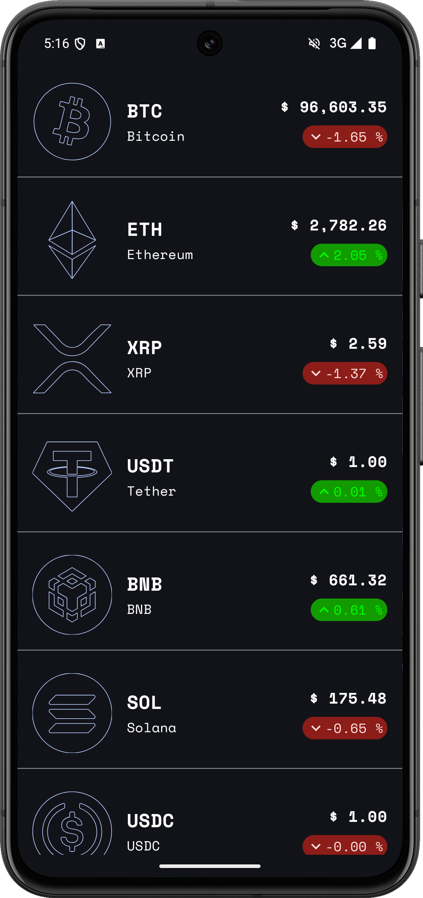

# CryptoTracker

CryptoTracker is an Android application built with Kotlin and Jetpack Compose that allows users to
track the prices and details of various cryptocurrencies. The app features a list of
cryptocurrencies and detailed views for each coin, including price history charts.

## Screenshots

<div style="display: flex; flex-wrap: wrap;">
  
  
  
</div>
<div style="display: flex; flex-wrap: wrap; margin-top: 1%;">
  
  
</div>

## Features

- **Cryptocurrency List**: View a list of cryptocurrencies with their current prices.
- **Coin Details**: Detailed view of each coin with additional information such as market cap,
  price, and 24-hour change.
- **Price History Chart**: Interactive line chart showing the price history of the selected coin.

## Technologies Used

- **Kotlin**: The primary programming language used for the app.
- **Jetpack Compose**: Modern toolkit for building native Android UI.
- **Ktor**: Framework for building asynchronous servers and clients in connected systems.
- **Koin**: Dependency injection framework for Kotlin.
- **Material3**: Design system for building high-quality digital experiences.

## Getting Started

### Prerequisites

- Android Studio Giraffe | 2022.3.1 or higher
- Kotlin 1.5+
- Gradle 7.0+

### Installation

1. **Clone the repository**:
    ```sh
    git clone https://github.com/joao-graca/cryptotracker.git
    cd cryptotracker
    ```

2. **Open the project in Android Studio**:
    - Open Android Studio.
    - Select "Open an existing project".
    - Navigate to the cloned repository and select it.

3. **Build the project**:
    - Click on the "Build" menu and select "Make Project".

4. **Run the app**:
    - Connect an Android device or start an emulator.
    - Click on the "Run" button or select "Run" from the "Run" menu.
